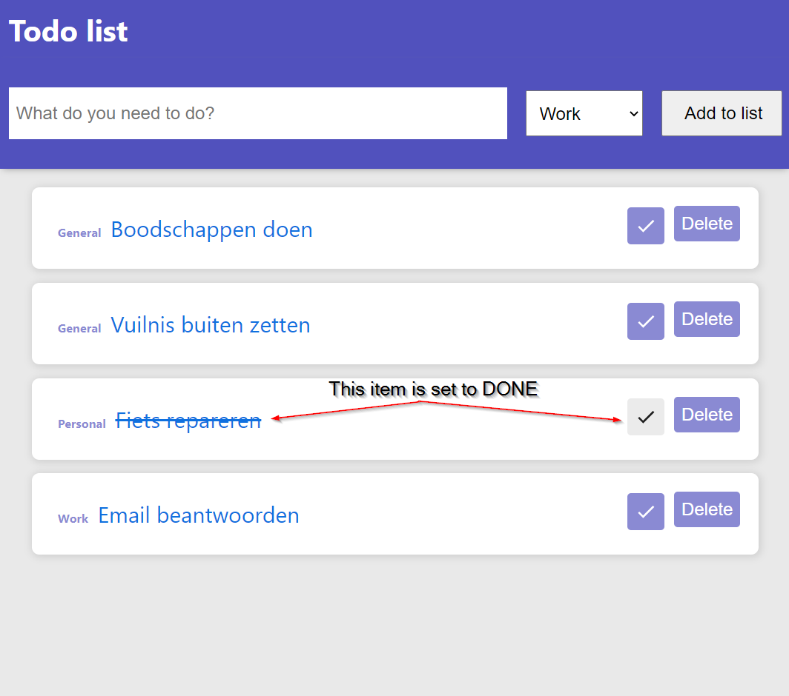

# TodoList app - Experiment with IndexedDB

## Assignment goals & description

*This assignment is part of the NoSql-course.*

The goal of this assignment is to learn about IndexedDB. IndexedDB is another example of browser storage. The big difference between indexedDB and other browser storage (like localStorage or cookies) is that indexedDB not only allowes users to store much more data but gives the user the option to create indexes that provide additional querying power to the user.

#

## Assignment:

For this assignment you are given a working application. It is a simple Todo list app written in React. However, some of the features in this app have not been fully implemented yet.

It is up to you to complete the missing functionality according to the given specifications below (*see acceptance criteria*).

### **Prerequisites:**

To complete this assignment you will need to following:

- Node.js should be installed on your PC
- You should have basic knowledge of React
- You should be aware of IndexedDB

## Getting started:

1. Clone the repo to your local machine
2. Navigate to the project root directory and run: `npm install`
3. To start the application run: `npm start`

## Acceptance Criteria

*Implement the **'Set to Done'** behavior. When a user clicks on the checkMark button the todo item status should be updated to indicate that it is done.*

**see expected design below**

- When user clicks the CheckMark button:
    - The indexedDB (*todoStatusDone*) should be updated.
    - Button state should change to indicate that item is done.
    - Todo text should be striped-through.
    - It should be a toggle button so clicking again should reverse the behavior.
    
## Acceptance Criteria **EXTRA** (optional)

*Implement the **'DeadLine'** behavior. When a user creates a new item he should be able to set a deadline for that item*

- In the **add-todo** component include a datepicker:
    - When the user adds a new item the deadline should be empty by default.
    - When the user has selected a DateTime before adding the item the deadline should be set to the given date in the DB.
    - If an item has a deadline the deadline should be visible on the item.
    - The item list should be sorted by deadline, the nearest date should be on top. (items without deadline should be at the bottom).
    - Items that have passed the deadline should display the todo text in red.

## Deliver:

- Implement the new feature(s) and commit & push your work.

# Resources and Tips:

- [YouTube - What is indexedDB](https://www.youtube.com/watch?v=3y3YECBXtG8&ab_channel=DwanWDev)
- [YouTube - Getting started with IndexedDB](https://www.youtube.com/watch?v=g4U5WRzHitM&t=718s&ab_channel=AllThingsJavaScript%2CLLC)
- [Dexie.js Docs - React library for IndexedDB](https://dexie.org/)
- [Dexie.js Docs - Get started with Dexie in React](https://dexie.org/docs/Tutorial/React)
- [Tutorial - Using Dexie.js in React](https://blog.logrocket.com/dexie-js-indexeddb-react-apps-offline-data-storage/)
- [MUI (component lib) - used for toggle button](https://mui.com/components/toggle-button/)

# Expected Design

